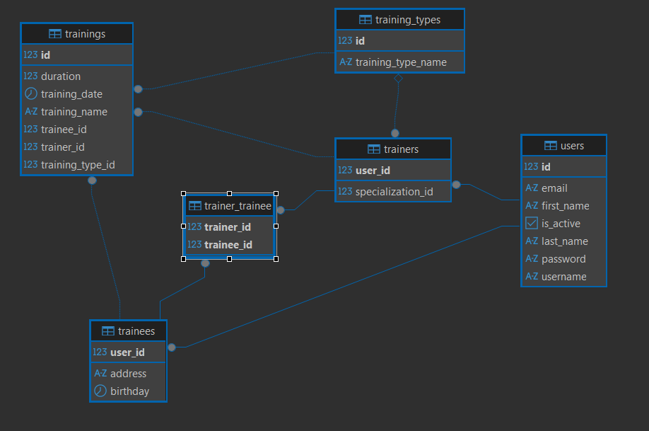

# Gym CRM System

A Customer Relationship Management (CRM) system for gym operations built with **Jakarta EE**, **JPA/Hibernate**, and **PostgreSQL**.  
This system manages trainers, trainees, and training sessions with a **clean layered architecture**, REST controllers, filters, DTO-based request/response handling, global exception management, and Swagger documentation.

## Features

### Authentication & Security
- Username/password authentication with role-based access control
- Secure login/logout
- Session validation via `X-Session-Id` header
- Method-level authorization for trainers, trainees, and resource owners
- Protected operations requiring authentication

### Password Security
- **BCrypt Encryption**: All user passwords are securely hashed using BCrypt algorithm
- **Spring Security Crypto**: Utilizes `BCryptPasswordEncoder` for industry-standard password hashing
- **Salt Generation**: BCrypt automatically generates unique salts for each password
- **Password Verification**: Secure password matching without storing plain text passwords
- **No Plain Text Storage**: Raw passwords are never stored in the database

```java
// Password encryption utility
public static String encryptPassword(String password) {
    return encoder.encode(password); // BCrypt hashing with automatic salt
}

public static boolean verifyPassword(String plainPassword, String hashedPassword) {
    return encoder.matches(plainPassword, hashedPassword); // Secure verification
}
```

### Trainer Management
- Create new trainers with specialization (CrossFit, Zumba, Functional, Boxing, Pilates, Bouldering)
- Retrieve specific trainer by username
- Update trainer information including personal details, specialization, and password
- Change trainer active state (activate/deactivate)
- Retrieve trainees assigned to a trainer
- Find unassigned trainers for a specific trainee

---

### Trainee Management
- Create new trainees with personal information (name, address, date of birth)
- Retrieve specific trainee by username
- Update trainee information including personal details and password
- Change trainee active state (activate/deactivate)
- Delete trainees by username
- Retrieve trainers assigned to a trainee
- Track trainee training history

---

### Training Management
- Create training sessions linking trainers and trainees
- Define training details including name, type, date, and duration
- Retrieve specific training session by ID
- Update training session details (name, type, date, duration)
- Retrieve trainings for a trainer with optional date range filters
- Retrieve trainings for a trainee with optional date range filters

## Technology Stack

- **Java 21** – Latest LTS version for optimal performance
- **Spring Framework 6** – Core application framework (Context, Beans, Web MVC, Transactions, ORM)
- **Spring Data JPA** – Simplified data access and repository abstraction
- **Hibernate (Jakarta)** – JPA implementation and ORM provider
- **PostgreSQL** – Production-ready relational database
- **H2 Database** – In-memory database for testing
- **Jakarta Persistence API (JPA 3.1)** – Persistence specification
- **Jakarta Servlet API 6** – Web servlet support
- **Jakarta Validation (Hibernate Validator 8)** – Bean validation
- **Jackson (Databind + JSR-310)** – JSON serialization/deserialization including Java 8+ date/time
- **MapStruct** – Mapper framework for DTO–Entity transformations
- **Spring Security Crypto (BCrypt)** – Secure password hashing
- **Swagger (springdoc-openapi)** – API documentation (OpenAPI 3)
- **Embedded Tomcat 10** – Servlet container for running the application

### Testing
- **JUnit 5** – Unit testing framework
- **Mockito** – Mocking framework (core + JUnit 5 integration)
- **Spring Test** – Spring-specific test utilities
- **JsonPath** – JSON assertions and schema validation

### Logging
- **SLF4J 2 + Logback** – Unified logging facade and implementation

## Project Structure

```
src/
├── main/
│   ├── java/com/jsalva/gymsystem/
│   │   ├── config/          # Configuration classes
│   │   ├── controller/      # REST controllers
│   │   │   └── advise/      # Global exception handler
│   │   ├── dto/             # Request/Response DTOs (records)
│   │   │   ├── request
│   │   │   └── response
│   │   ├── entity/          # JPA entities
│   │   ├── exception/       # Custom exceptions
│   │   ├── facade/          # Facade layer
│   │   │   └── impl
│   │   ├── filter/          # Filters (Logging, TransactionId)
│   │   ├── mapper/          # DTO ↔ Entity mapping
│   │   ├── repository/      # Persistence layer
│   │   │   └── impl
│   │   ├── service/         # Business logic
│   │   │   └── impl
│   │   └── utils/           # Utilities (encoder, helpers)
│   └── resources/
│       ├── init/            # Initial data
│       ├── META-INF/        # JPA config (persistence.xml)
│       └── data.sql         # Seed data
└── test/                    # Unit & integration tests
    └── java/com/jsalva/gymsystem/
        ├── controller/
        ├── repository/
        ├── service/
        └── utils/

```

## Database Schema

The system uses JPA inheritance strategy with the following entity relationships:

### Core Entities
- **User** (base entity) - Contains common user information
- **Trainer** (extends User) - Specializes in specific training types
- **Trainee** (extends User) - Gym members with personal details
- **Training** - Training sessions linking trainers and trainees
- **TrainingType** - Available training specializations

### Entity Relationships
- User (1) ← (1) Trainer/Trainee (Table per class inheritance)
- Trainer (1) → (N) Training
- Trainee (1) → (N) Training
- TrainingType (1) → (N) Training
- TrainingType (1) → (N) Trainer (specialization)



## Getting Started

### Prerequisites

- Java 21 or higher
- Maven 3.6+
- PostgreSQL 12+
- Git

### Database Setup

1. Install PostgreSQL and create a database:
```sql
CREATE DATABASE gymdb;
```

2. The application will automatically create tables using Hibernate DDL generation.

### Installation

1. Clone the repository:
```bash
git clone https://github.com/Jsalvar124/gym-crm-system.git
cd gym-crm-system
```

2. Configure database connection in `persistence.xml`: password and username are set to postgres by default.
```xml
<property name="jakarta.persistence.jdbc.url" value="jdbc:postgresql://localhost:5432/gymdb"/>
<property name="jakarta.persistence.jdbc.user" value="{YOUR-USERNAME}"/>
<property name="jakarta.persistence.jdbc.password" value="{YOUR-PASSWORD}"/>
```

3. Build the project:
```bash
mvn clean compile
```

4. Run tests:
```bash
mvn test
```

5. Package the application:
```bash
mvn package
```

### Running Locally

1. Ensure PostgreSQL is running and the database is created
2. The application will automatically:
   - Create/update database schema via Hibernate
   - Load initial training types from `data.sql`

3. Run the application using Maven:
```bash
mvn exec:java -Dexec.mainClass="com.jsalva.gymsystem.Main"
```

### Configuration

Database and JPA configuration in `persistence.xml`:

```xml
<properties>
    <property name="hibernate.jdbc.time_zone" value="UTC"/>
    <property name="hibernate.dialect" value="org.hibernate.dialect.PostgreSQL10Dialect"/>
    <property name="jakarta.persistence.jdbc.driver" value="org.postgresql.Driver"/>
    <property name="jakarta.persistence.jdbc.url" value="jdbc:postgresql://localhost:5432/gymdb"/>
    <property name="jakarta.persistence.jdbc.user" value="{YOUR-USERNAME}"/>
    <property name="jakarta.persistence.jdbc.password" value="{YOUR-PASSWORD}"/>
    <property name="hibernate.hbm2ddl.auto" value="create-drop"/>
    <property name="jakarta.persistence.sql-load-script-source" value="data.sql"/>
</properties>
```

## Swagger UI

Interactive API documentation is available through Swagger UI.

- **URL:** [http://localhost:8080/swagger-ui.html](http://localhost:8080/swagger-ui.html)


## Training Types

The system supports the following training specializations:

- **CROSSFIT** - High-intensity functional movements
- **ZUMBA** - Dance fitness program
- **FUNCTIONAL** - Functional movement training
- **BOXING** - Combat sports training
- **PILATES** - Low-impact flexibility and strength
- **BOULDERING** - Rock climbing training

## Architecture

The system follows a **layered architecture** pattern with clear separation of concerns:

### Layers
- **Controller Layer**: Exposes REST endpoints and delegates requests to the facade.
- **Facade Layer**: Provides a unified interface, handling orchestration and security.
- **Service Layer**: Encapsulates business logic and domain rules.
- **Repository Layer**: Manages persistence with JPA/Hibernate.
- **Entity Layer**: JPA entities modeling the domain (User, Trainer, Trainee, Training).
- **Configuration Layer**: Application, persistence, and framework setup.

### Cross-cutting Components
- **Filters**: Request/response logging, transaction IDs, etc.
- **Global Exception Handler**: Consistent error handling and responses.
- **API Documentation**: Swagger/OpenAPI for interactive documentation.


## Security Features

### Authentication
- Username/password based login returning a **session ID**
- Clients must include the session ID in request headers for all authenticated operations
- Logout invalidates the session
- Session tracking includes username and user type (Trainer/Trainee)

### Authorization
- All validations are performed using the session ID from headers
- Role-based access control:
    - `validateLogin(sessionId)` — Ensures valid session
    - `validateTrainerAuth(sessionId)` — Trainer-only operations
    - `validateOwnerAuth(sessionId, targetUsername)` — Validates resource ownership
    - `validateTrainerOrOwnerAuth(sessionId, targetUsername)` — Allows trainer or resource owner
- Password update operations validate old password before applying changes

## Testing

The project includes comprehensive unit tests covering:

- Repository layer functionality
- Service layer business logic
- Facade layer orchestration
- Controller layer with `MockMvc` for endpoint validation
- Utility classes and helpers

```bash
# Run all tests
mvn test

# Run tests with coverage (IDE)
# Right-click on test directory → "Run All Tests with Coverage"

# Run specific test class
mvn test -Dtest=TrainerServiceTest
```

## Migration from Previous Version

This version expands the project with new infrastructure, security, and API features:

### What Changed
- **Security**: Added session-based authentication and authorization
- **API Documentation**: Introduced Swagger/OpenAPI integration
- **Filters**: Added request filters for transaction ID tracking and login handling
- **DTOs**: Implemented request/response DTOs for clean API contracts
- **Controllers**: Added REST controllers exposing the Facade layer
- **Server**: Migrated to embedded Tomcat for running the application
- **Error Handling**: Introduced custom exceptions and centralized error handling with `@ControllerAdvice`

### What Remained
- **Data Layer**: PostgreSQL database with JPA/Hibernate repositories
- **Persistence**: JPA entities and repository-based access
- **Core Business Logic**: Trainer, trainee, and training management
- **Architecture Principles**: Layered design with separation of concerns
- **Build System**: Maven-based build and dependency management


## License

This project is part of the EPAM Java Specialization program and is intended for educational purposes.

## Author

**Julián Salvá Ramírez** - [GitHub Profile](https://github.com/Jsalvar124)
