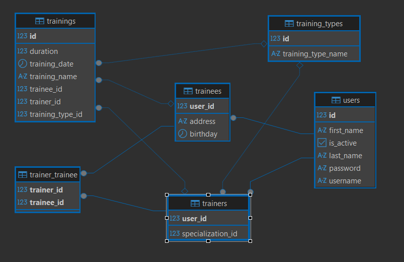

# Gym CRM System

A Customer Relationship Management (CRM) system for gym operations built with JPA/Hibernate and PostgreSQL. This system manages trainers, trainees, and training sessions with a clean layered architecture and an authentication mechanism.

## Features

### Authentication & Security
- User authentication system with role-based access control
- Secure login/logout functionality
- Method-level authorization for trainers, trainees, and resource owners
- Protected operations requiring proper authentication

### Trainer Management
- Create new trainers with specialization (CrossFit, Zumba, Functional, Boxing, Pilates, Bouldering)
- Retrieve all trainers or specific trainer by ID/username
- Update trainer information including personal details, specialization, password, and active status
- Toggle trainer active state
- Find unassigned trainers for specific trainees

### Trainee Management
- Create new trainees with personal information (name, address, date of birth)
- Retrieve all trainees or specific trainee by ID/username
- Update trainee information including personal details, password, and active status
- Toggle trainee active state
- Delete trainees from the system by username or id.
- Track trainee training history

### Training Management
- Create training sessions linking trainers and trainees
- Define training details including name, type, date, and duration
- Retrieve all training sessions or specific training by ID
- Filter trainings by trainer/trainee username and date ranges
- Track training history and schedules

## Technology Stack

- **Java 21** - Latest LTS version for optimal performance
- **JPA/Hibernate** - Object-relational mapping and persistence
- **PostgreSQL** - Production-ready relational database
- **Jakarta Persistence API** - Modern JPA specification
- **Maven** - Build automation and dependency management
- **JUnit 5** - Unit testing framework
- **Mockito** - Mocking framework for testing
- **SLF4J + Logback** - Logging framework

## Project Structure

```
src/
├── main/
│   ├── java/com/jsalva/gymsystem/
│   │   ├── config/          # Configuration classes
│   │   ├── entity/          # JPA entities (User, Trainer, Trainee, Training, TrainingType)
│   │   ├── facade/          # Business facade layer
│   │   │   └── impl/        # Facade implementations
│   │   ├── repository/      # Data access layer (JPA repositories)
│   │   │   └── impl/        # Repository implementations
│   │   ├── service/         # Business logic layer
│   │   │   └── impl/        # Service implementations
│   │   └── utils/           # Utility classes
│   └── resources/
│       ├── init/            # Initial data files
│       ├── META-INF/        # JPA configuration
│       │   └── persistence.xml
│       └── data.sql         # Database seed data
└── test/                    # Unit and integration tests
    └── java/com/jsalva/gymsystem/
        ├── repository/      # Repository tests
        ├── service/         # Service tests
        └── utils/           # Utility tests
```

## Database Schema

The system uses JPA inheritance strategy with the following entity relationships:

### Core Entities
- **User** (base entity) - Contains common user information
- **Trainer** (extends User) - Specializes in specific training types
- **Trainee** (extends User) - Gym members with personal details
- **Training** - Training sessions linking trainers and trainees
- **TrainingType** - Available training specializations

### Entity Relationships
- User (1) ← (1) Trainer/Trainee (Table per class inheritance)
- Trainer (1) → (N) Training
- Trainee (1) → (N) Training
- TrainingType (1) → (N) Training
- TrainingType (1) → (N) Trainer (specialization)



## Getting Started

### Prerequisites

- Java 21 or higher
- Maven 3.6+
- PostgreSQL 12+
- Git

### Database Setup

1. Install PostgreSQL and create a database:
```sql
CREATE DATABASE gymdb;
```

2. The application will automatically create tables using Hibernate DDL generation.

### Installation

1. Clone the repository:
```bash
git clone https://github.com/Jsalvar124/gym-crm-system.git
cd gym-crm-system
```

2. Configure database connection in `persistence.xml`: password and username are set to postgres by default.
```xml
<property name="jakarta.persistence.jdbc.url" value="jdbc:postgresql://localhost:5432/gymdb"/>
<property name="jakarta.persistence.jdbc.user" value="{YOUR-USERNAME}"/>
<property name="jakarta.persistence.jdbc.password" value="{YOUR-PASSWORD}"/>
```

3. Build the project:
```bash
mvn clean compile
```

4. Run tests:
```bash
mvn test
```

5. Package the application:
```bash
mvn package
```

### Running Locally

1. Ensure PostgreSQL is running and the database is created
2. The application will automatically:
   - Create/update database schema via Hibernate
   - Load initial training types from `data.sql`

3. Run the application using Maven:
```bash
mvn exec:java -Dexec.mainClass="com.jsalva.gymsystem.Main"
```

### Configuration

Database and JPA configuration in `persistence.xml`:

```xml
<properties>
    <property name="hibernate.jdbc.time_zone" value="UTC"/>
    <property name="hibernate.dialect" value="org.hibernate.dialect.PostgreSQL10Dialect"/>
    <property name="jakarta.persistence.jdbc.driver" value="org.postgresql.Driver"/>
    <property name="jakarta.persistence.jdbc.url" value="jdbc:postgresql://localhost:5432/gymdb"/>
    <property name="jakarta.persistence.jdbc.user" value="{YOUR-USERNAME}"/>
    <property name="jakarta.persistence.jdbc.password" value="{YOUR-PASSWORD}"/>
    <property name="hibernate.hbm2ddl.auto" value="update"/>
    <property name="jakarta.persistence.sql-load-script-source" value="data.sql"/>
</properties>
```

## Training Types

The system supports the following training specializations:

- **CROSSFIT** - High-intensity functional movements
- **ZUMBA** - Dance fitness program
- **FUNCTIONAL** - Functional movement training
- **BOXING** - Combat sports training
- **PILATES** - Low-impact flexibility and strength
- **BOULDERING** - Rock climbing training

## Architecture

The system follows a layered architecture pattern with clear separation of concerns:

### Layers
- **Facade Layer**: Provides a unified interface with authentication and authorization
- **Service Layer**: Contains business logic and orchestrates operations
- **Repository Layer**: Handles data persistence using JPA/Hibernate
- **Entity Layer**: JPA entities representing the domain model
- **Configuration Layer**: Application and persistence configuration

## Security Features

### Authentication
- Username/password based authentication
- Session management with login/logout functionality
- User type tracking (Trainer/Trainee)

### Authorization
- Method-level security annotations
- Role-based access control:
   - `requireAuthentication()` - Basic authentication required
   - `requireTrainerAuthentication()` - Trainer-only operations
   - `requireTraineeAuthentication()` - Trainee-only operations
   - `requireOwnership(userId)` - Resource ownership validation

### Access Control Examples
```java
// Trainer-only operations
void createTraining(...); // Requires trainer authentication

// Owner-only operations  
void updateTrainerPassword(Long id, String newPassword); // Requires ownership of the trainer account

// General authenticated operations
List<Training> getAllTrainings(); // Requires any valid authentication
```

## Testing

The project includes comprehensive unit tests covering:

- Repository layer functionality
- Service layer business logic
- Utility classes and helpers

```bash
# Run all tests
mvn test

# Run tests with coverage (IDE)
# Right-click on test directory → "Run All Tests with Coverage"

# Run specific test class
mvn test -Dtest=TrainerServiceTest
```

## Migration from Previous Version

This version represents a significant architectural upgrade:

### What Changed
- **Data Layer**: CSV files → PostgreSQL database
- **ORM**: Custom DAO → JPA/Hibernate entities
- **Framework**: Spring Core → Pure JPA with Jakarta Persistence
- **Architecture**: Added authentication and authorization layer
- **Entities**: Introduced proper inheritance hierarchy

### What Remained
- Core business functionality
- Layered architecture principles
- Comprehensive testing approach
- Maven build system

## License

This project is part of the EPAM Java Specialization program and is intended for educational purposes.

## Author

**Julián Salvá Ramírez** - [GitHub Profile](https://github.com/Jsalvar124)
---
